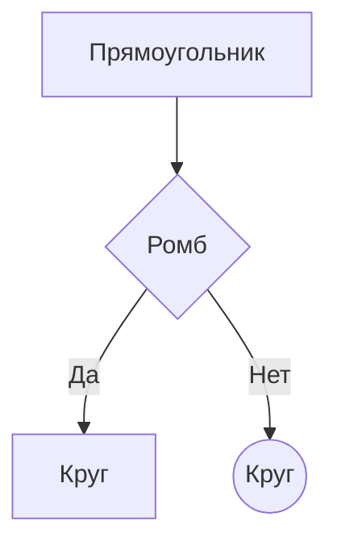
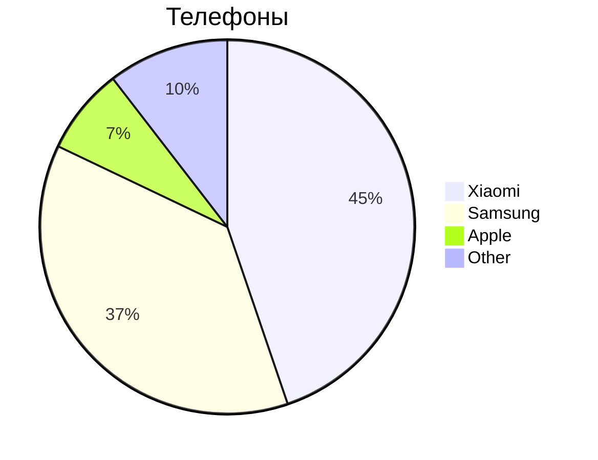

## Mermaid
***Mermaid* специальный язык для построения диаграмм, блок-схема и графиков

- `TD` - направление сверху-вниз
-  `-->` - стрелка связи
- `|Текст|` - подпись стрелки 
- `{Text}` - ромб (условие)

### Кпуговая диограмма 

