# Mermaid: примеры блок-схем, графиков и диаграмм

Каждый пример — отдельный блок ```` ```mermaid ````. Файл открывается в GitHub, GitLab, Obsidian, VS Code (с расширением Markdown Preview Mermaid Support) и на mermaid.live.

## Оглавление

1. Блок-схемы (flowchart)
2. Диаграмма последовательности (sequence)
3. Диаграмма классов (class)
4. Диаграмма состояний (state)
5. ER-диаграмма
6. Пользовательский путь (journey)
7. Диаграмма Ганта
8. Круговая диаграмма (pie)
9. Квадрантная диаграмма
10. Диаграмма требований
11. Git-граф
12. Ментальная карта (mindmap)
13. Временная шкала (timeline)
14. Sankey
15. XY-график (столбцы и линии)
16. Блочная диаграмма
17. Пакетная диаграмма
18. Канбан
19. Архитектурная диаграмма
20. C4-диаграмма

---

## 1. Блок-схемы (flowchart)

### 1.1. Базовая схема

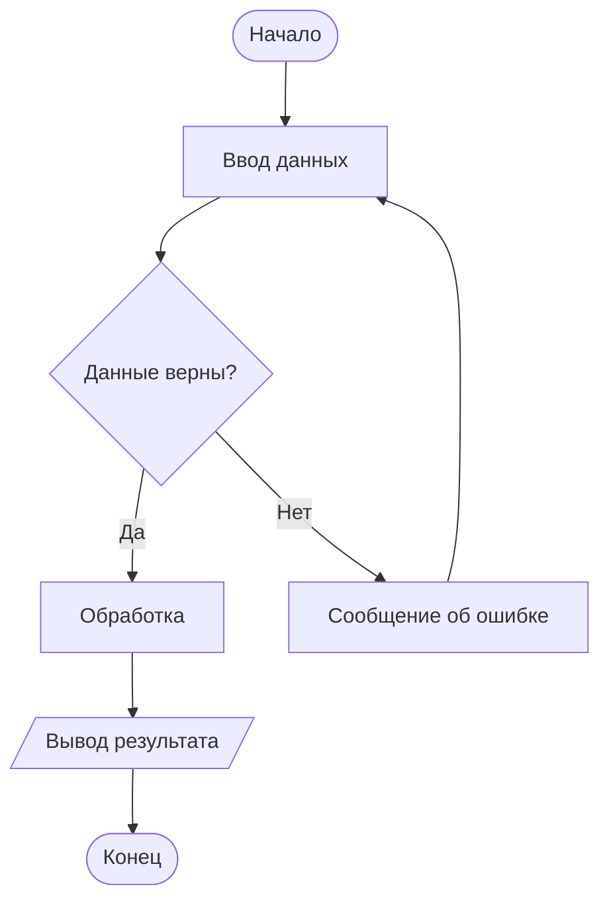

### 1.2. Направления: LR, RL, TB, BT

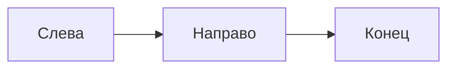

### 1.3. Все формы узлов

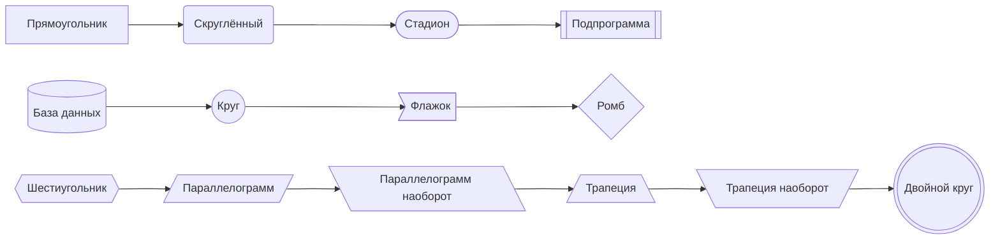

### 1.4. Типы связей

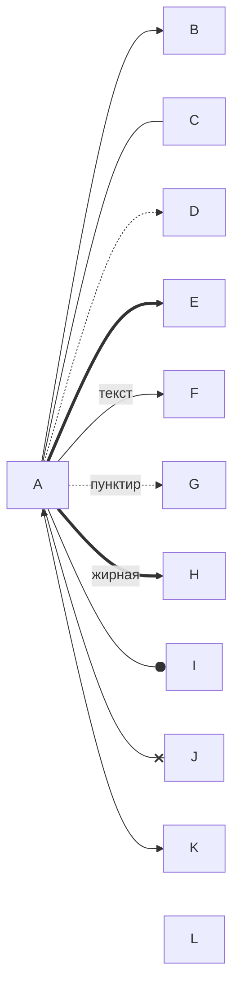

### 1.5. Подграфы (subgraph)

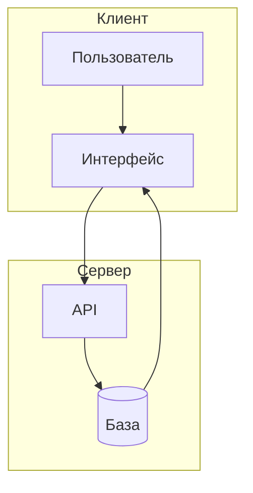

### 1.6. Стилизация

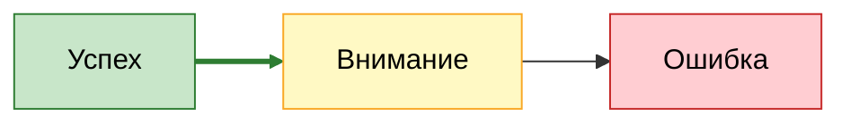

### 1.7. Алгоритм: чётное или нечётное

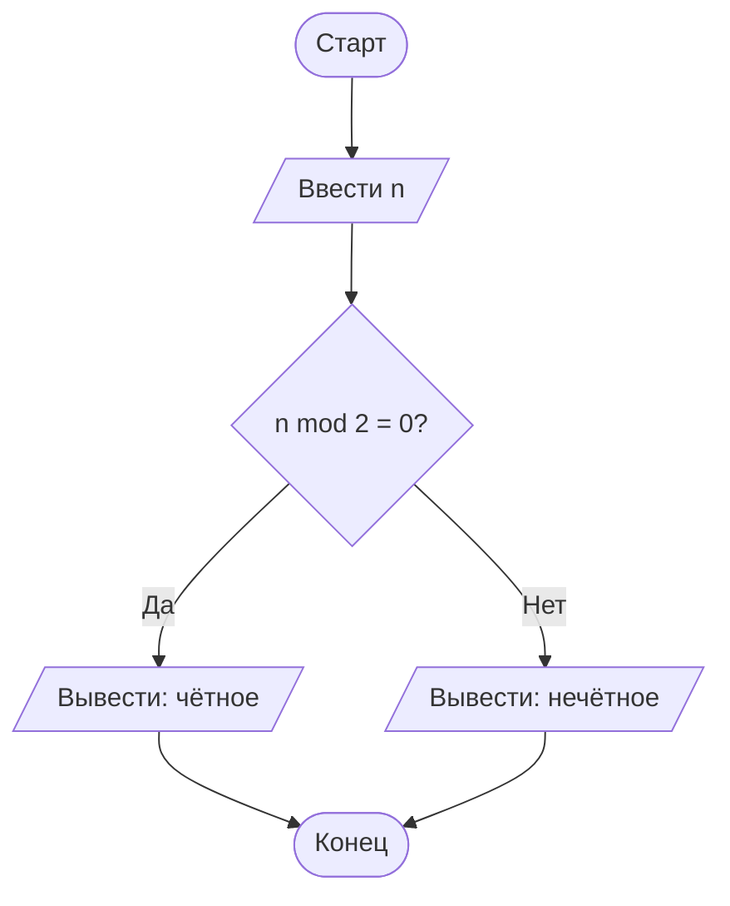

### 1.8. Цикл

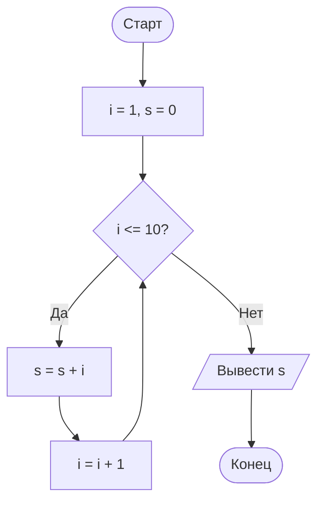

---

## 2. Диаграмма последовательности (sequence)

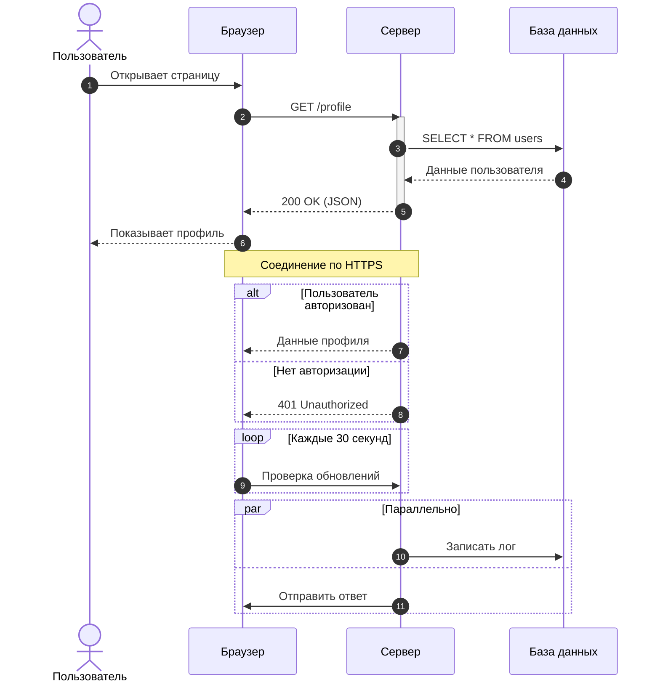

---

## 3. Диаграмма классов (class)

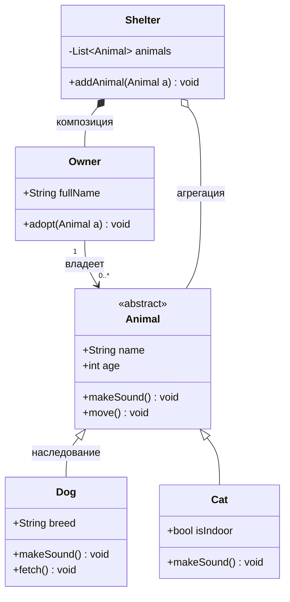

---

## 4. Диаграмма состояний (state)

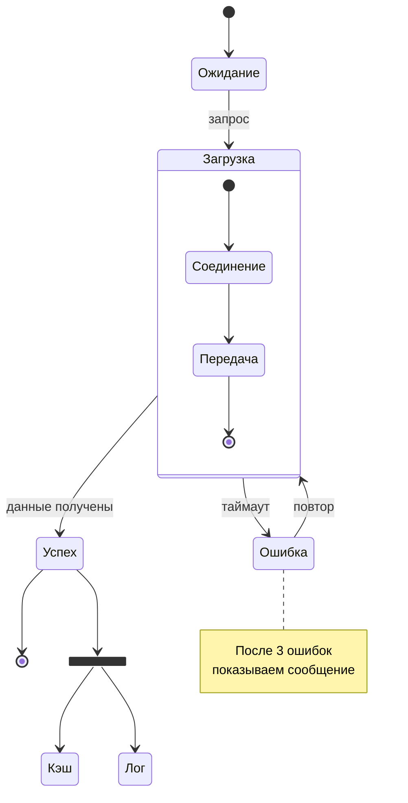

---

## 5. ER-диаграмма

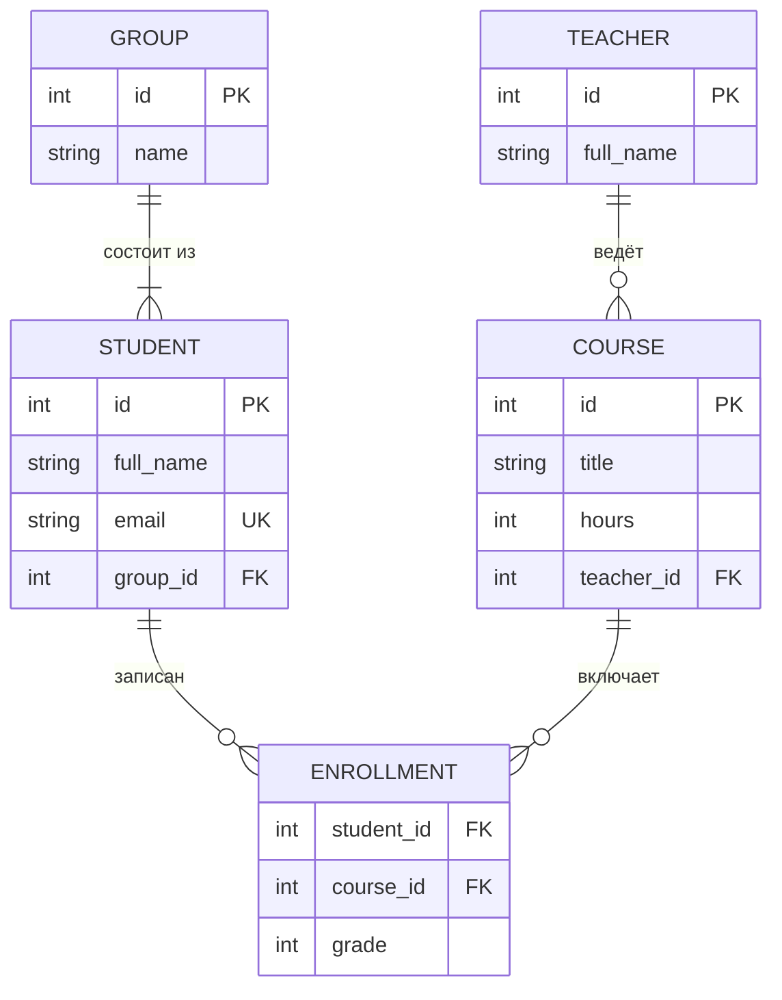

---

## 6. Пользовательский путь (journey)

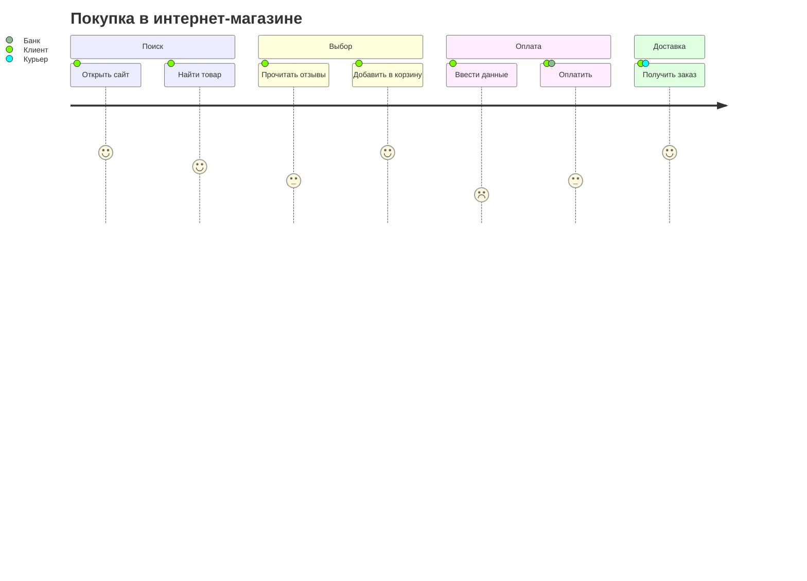

---

## 7. Диаграмма Ганта

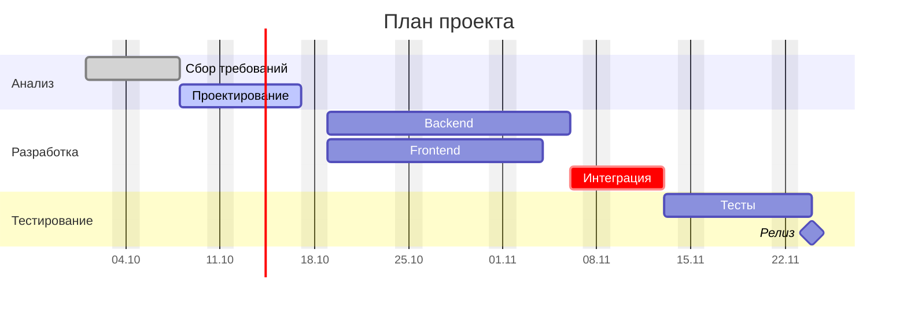

---

## 8. Круговая диаграмма (pie)

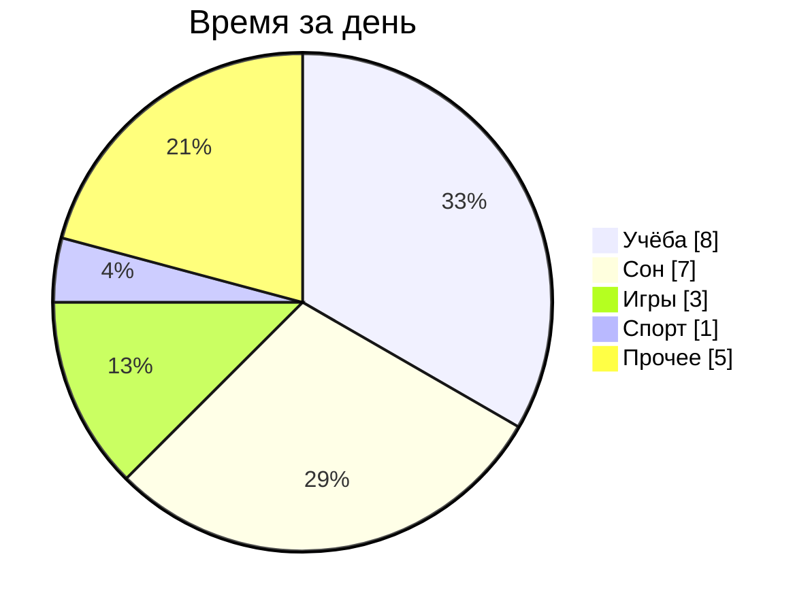

---

## 9. Квадрантная диаграмма

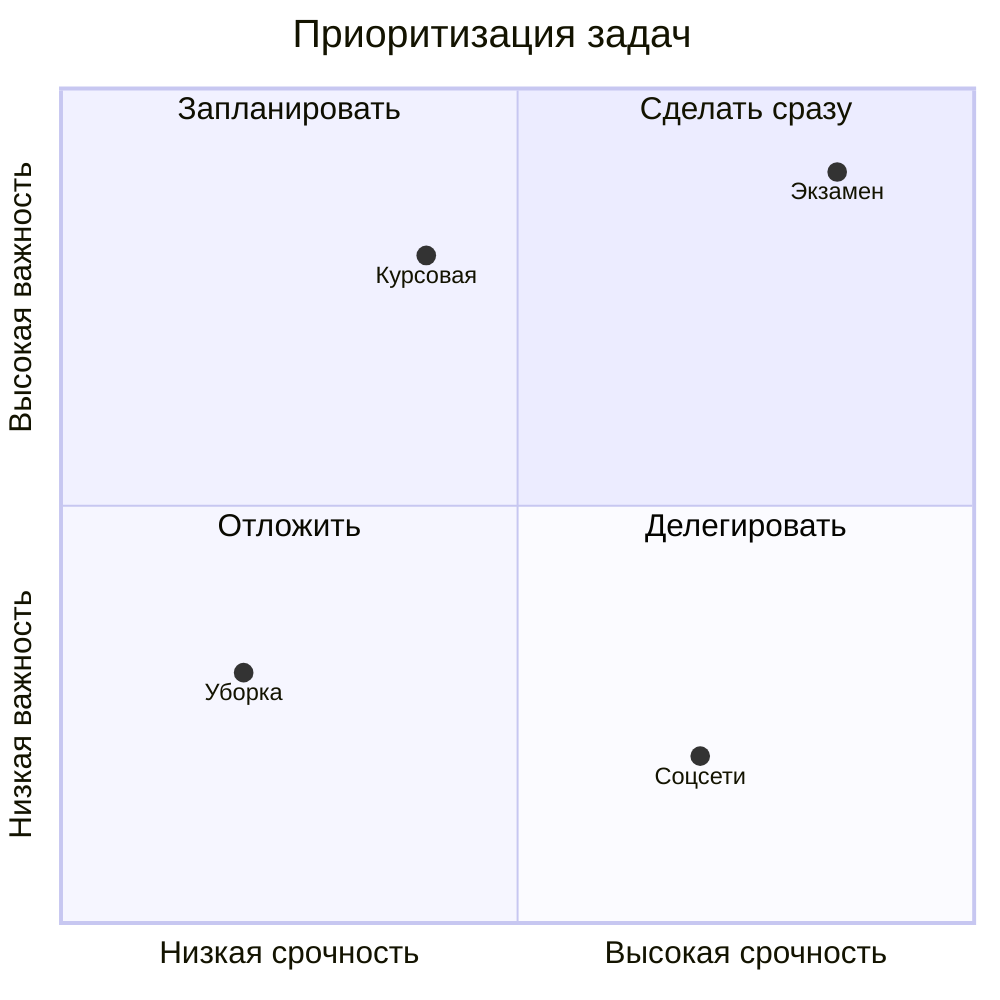

---

## 10. Диаграмма требований

```mermaid
requirementDiagram
    requirement login_req {
        id: 1
        text: Пользователь должен входить по логину и паролю
        risk: high
        verifymethod: test
    }
    functionalRequirement session_req {
        id: 1.1
        text: Сессия истекает через 30 минут
        risk: medium
        verifymethod: inspection
    }
    element auth_module {
        type: module
        docref: auth.md
    }

    login_req - contains -> session_req
    auth_module - satisfies -> login_req
```

---

## 11. Git-граф

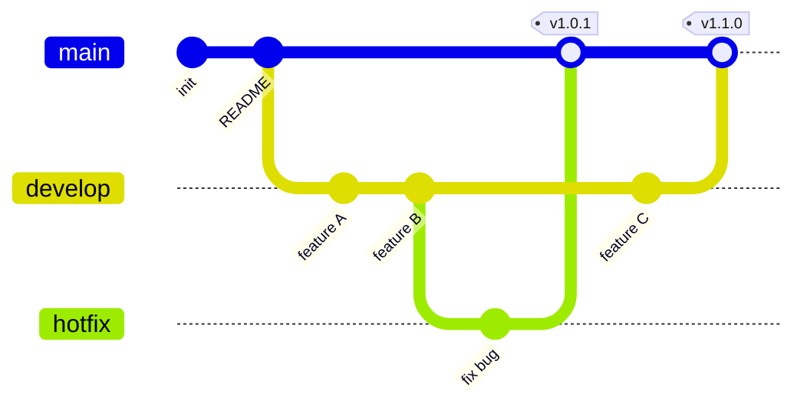

---

## 12. Ментальная карта (mindmap)

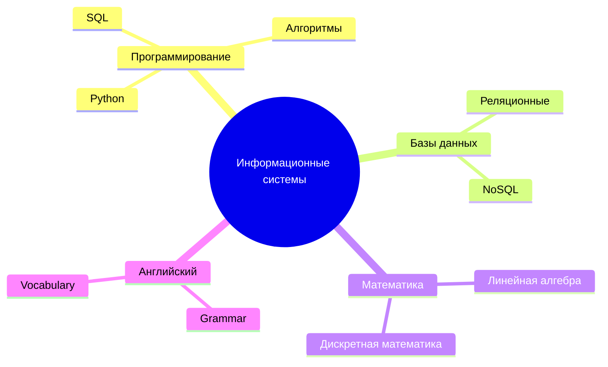

---

## 13. Временная шкала (timeline)

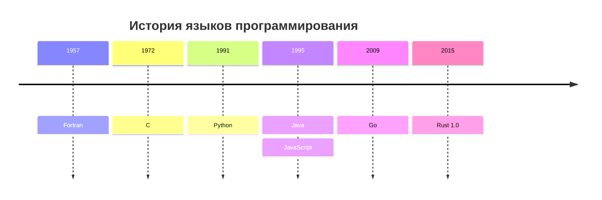

---

## 14. Sankey

```mermaid
sankey-beta

Зарплата,Аренда,30
Зарплата,Еда,25
Зарплата,Транспорт,10
Зарплата,Накопления,20
Зарплата,Развлечения,15
```

---

## 15. XY-график (столбцы и линия)

```mermaid
xychart-beta
    title "Продажи по месяцам"
    x-axis [янв, фев, мар, апр, май, июн]
    y-axis "Тыс. руб." 0 --> 100
    bar [20, 35, 50, 45, 70, 90]
    line [20, 35, 50, 45, 70, 90]
```

---

## 16. Блочная диаграмма

```mermaid
block-beta
    columns 3
    A["Frontend"] B["Backend"] C["База данных"]
    D["Интернет"]:3
    A --> B
    B --> C
```

---

## 17. Пакетная диаграмма

```mermaid
packet-beta
    0-15: "Порт источника"
    16-31: "Порт назначения"
    32-63: "Порядковый номер"
    64-95: "Номер подтверждения"
    96-99: "Смещение"
    100-105: "Резерв"
    106-111: "Флаги"
    112-127: "Окно"
```

---

## 18. Канбан

```mermaid
kanban
  todo[К выполнению]
    t1[Написать конспект]
    t2[Подготовить доклад]
  doing[В работе]
    t3[Лабораторная по SQL]
  done[Готово]
    t4[Сдать реферат]
```

---

## 19. Архитектурная диаграмма

```mermaid
architecture-beta
    group cloud(cloud)[Облако]

    service web(server)[Веб-сервер] in cloud
    service api(server)[API] in cloud
    service db(database)[База данных] in cloud
    service disk(disk)[Хранилище] in cloud

    web:R --> L:api
    api:R --> L:db
    db:B -- T:disk
```

---

## 20. C4-диаграмма

```mermaid
C4Context
    title Система учёта студентов
    Person(student, "Студент", "Смотрит расписание и оценки")
    Person(teacher, "Преподаватель", "Выставляет оценки")
    System(portal, "Учебный портал", "Веб-приложение")
    System_Ext(mail, "Почтовый сервис", "Отправка уведомлений")

    Rel(student, portal, "Использует")
    Rel(teacher, portal, "Использует")
    Rel(portal, mail, "Отправляет письма")
```

---

> Примечание: типы с суффиксом `-beta` (sankey, xychart, block, packet, architecture) и `kanban`, `C4Context` появились в новых версиях Mermaid. Если диаграмма не отрисовывается, обновите Mermaid или проверьте код на mermaid.live.
