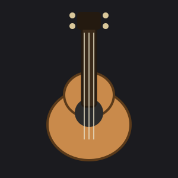
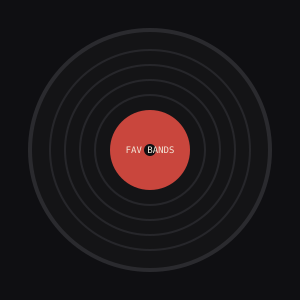
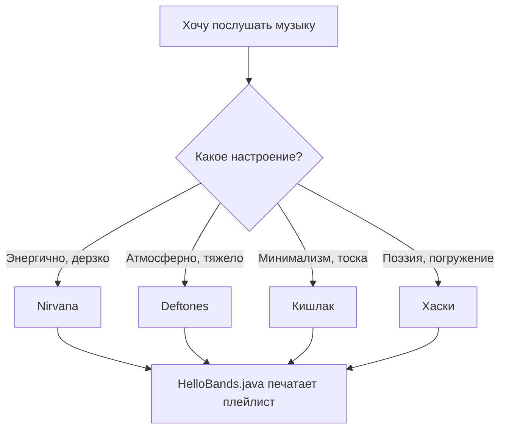

# 🎸 My Favorite Bands

### Hello, World! в мире музыки

  


---

## 🧭 Навигация

- [О проекте](#-о-проекте)
- [Любимые группы](#-любимые-группы)
- [Структура проекта](#-структура-проекта)
- [Исходный код](#-исходный-код)
- [Диаграмма](#-как-это-устроено)
- [Список задач](#-todo)
- [Полезные ссылки](#-ссылки)

---

## 📖 О проекте

Этот репозиторий — **не реальный музыкальный сервис**, а *учебная демонстрация* оформления `README.md`. Здесь есть немного Java-кода, немного картинок и ~~много~~ **вообще никакой** магии — просто аккуратная документация.

Три факта о проекте:

1. Написан за один вечер ради практики.
2. Внутри лежит класс `HelloBands`, который печатает список групп в консоль.
3. Структура повторяет типичный pet-проект: `src/`, `translations/`, `resources/`.

> «Без музыки жизнь была бы ошибкой».
> — Фридрих Ницше

---

## 🎧 Любимые группы

<p>
  
  
  
</p>


### Nirvana
Гранж-группа из провинциального городка Абердин, штат Вашингтон. Основана в 1987 году Куртом Кобейном и Кристом Новоселичем, позже к ним присоединился барабанщик Дэйв Грол. До Nirvana в маленьких провинциальных городах США гранж вообще не считался чем-то, способным выйти на большую сцену — это была локальная тусовка с грязным, тяжёлым звуком.

Всё изменилось с выходом альбома Nevermind в 1991 году: сингл «Smells Like Teen Spirit» неожиданно для самой группы стал хитом номер один, и подростковая тоска, гаражный драйв и рёв гитар внезапно оказались мейнстримом. Через три года, в 1994-м, Кобейн покончил с собой — группа просуществовала всего 7 лет, но успела полностью переопределить звучание рок-музыки на десятилетия вперёд.


### Deftones
Альтернативный метал-коллектив из Сакраменто, Калифорния, образован в 1988 году вокруг вокалиста Чино Морено и гитариста Стефана Карпентера. В отличие от типичного метала девяностых с его агрессией и грубостью, Deftones с самого начала звучали иначе: тяжёлые риффы у них соседствуют с почти шугейзовой, обволакивающей, местами даже красивой атмосферой.

Именно эта смесь — жёсткость плюс мечтательность — сделала их одной из самых влиятельных групп альт-метал сцены. Ключевые альбомы: White Pony (2000) и Around the Fur (1997). Группа до сих пор активна и регулярно выпускает новую музыку.


### Кишлак
Настоящее имя — **Максим Фисенко**. Начинал в Мурманской области под разными проектами («Автостопом по фазе сна» и другими), пока не пришёл к образу «Кишлак» — сырому, лоу-фай рэпу с элементами панка и фолка. Тексты у него намеренно грубые и провокационные: часто про наркотики, психические расстройства и жизнь на грани, поданные почти как исповедь.

В начале 2022 года он переехал в Москву и с тех пор выпустил несколько альбомов подряд — «Эскапист», «СХИК 2», «Пацанский эмо-рэп 2» и последний, POPSA 2025 (май 2025). У него много совместных треков с другими артистами — Хаски, Лаудом, «семьсот семь» и другими. Одна из фишек образа — окрашенные в чёрный белки глаз.


> 💡 Артист взял себе в качестве псевдонима слово «кишлак» — так называют небольшие поселения в Средней Азии.

### Хаски
Настоящее имя — **Дмитрий Кузнецов**, родился в 1993 году в Иркутске, но детство провёл в Бурятии. Учился на журфаке МГУ, работал на федеральных телеканалах, даже успел поработать фоторепортёром на Донбассе — но в итоге полностью ушёл в музыку.

Стиль Хаски — мрачный, депрессивный, с густой метафоричностью и социальным подтекстом: он пишет не про клубы и деньги, а про провинциальную безнадёгу, семью и поиск себя. За поэтичность его нередко сравнивают с Есениным. Псевдоним объясняет просто: собака — способ спрятаться за нечеловеческим образом, отстраниться от собственной личности. Известен также резонансными концертами — например, в 2024 году выступление в Омске сорвали из-за нападения на артиста и зрителей.


---

## 🗂 Структура проекта

Нумерованный список ниже — это навигатор по всем файлам, созданным в папках `src/`, ссылки на фото в браузере, `translations/` и `resources/`.

1. [`src/HelloBands.java`](src/HelloBands.java) — точка входа, печатает приветствие и список групп.
2. [`src/Band.java`](src/Band.java) — простой класс-модель `Band`.
3. [`translations/README.en.md`](translations/README.en.md) — версия документа на английском языке.
4. [`resources/guitar.svg`](resources/guitar.svg) — иконка гитары.
5. [`resources/vinyl.svg`](resources/vinyl.svg) — иконка виниловой пластинки.
6. [`resources/headphones.svg`](resources/headphones.svg) — иконка наушников.
7. `https://www.rockfm.ru/uploads/photos/1/2020/09/black%20sabbath/nirvana-4ddaf131354a8.jpg` — Nirvana.
8. `resources/sacramento-skyline.jpg` — Deftones.
9. `https://i.scdn.co/image/ab6761610000517472b36cc95e3c4e0fb08c5ad2` — фото кишлака.
10. `https://s09.stc.yc.kpcdn.net/share/i/12/12799256/de-1200x900.jpg` — фото собаки хаски, символ артиста «Хаски» (добавь сам, свободная лицензия).

---

## 💻 Исходный код

Пример форматированного кода на Java из [`src/HelloBands.java`](src/HelloBands.java):

```java
import java.util.List;

public class HelloBands {
    public static void main(String[] args) {
        System.out.println("Hello, World! Это плейлист моей жизни 🎧");

        List<Band> favorites = List.of(
                new Band("Nirvana", "Grunge", 1987),
                new Band("Deftones", "Alternative Metal", 1988),
                new Band("Кишлак", "Пост-панк", 2018),
                new Band("Хаски", "Хип-хоп / Поэзия", 2013)
        );

        favorites.forEach(band -> System.out.println(" - " + band));
    }
}
```

---

## 🧩 Как это устроено



---

## ✅ TODO

- [x] Написать `HelloBands.java`
- [x] Добавить иконки в `resources/`
- [x] Сделать перевод на английский
- [ ] Добавить ещё 2-3 группы в плейлист
- [ ] Прикрутить юнит-тесты для `Band`
- [ ] Опубликовать через GitHub Pages

---

## 🔗 Ссылки

- Английская версия документа: [`translations/README.en.md`](translations/README.en.md)
- Примеры оформления README, вдохновившие оформление: [Lazyjournal](https://github.com/darthnorse/dockmon/), [GitType](https://github.com/unhappychoice/gittype)
- [Официальный синтаксис Markdown](https://www.markdownguide.org/basic-syntax/)
- [Документация Mermaid](https://mermaid.js.org/)

---

<sub>Сделано в рамках самостоятельной работы по контролю версий и Markdown.</sub>
