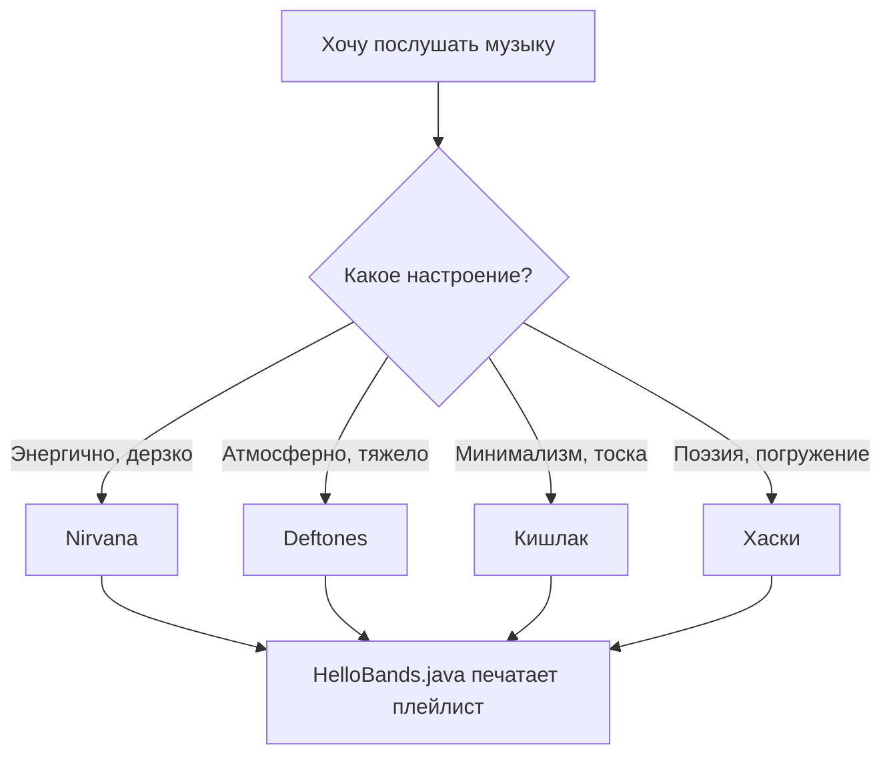

# 🎸 My Favorite Bands

### Hello, World! в мире музыки

  

Учебный pet-проект в стиле **«Hello, World!»**, сделанный, чтобы попрактиковаться в Git и Markdown. Вместо абстрактного примера — небольшая витрина групп, которые я слушаю чаще всего.

---

## 🧭 Навигация

- [О проекте](#-о-проекте)
- [Любимые группы](#-любимые-группы)
- [Структура проекта](#-структура-проекта)
- [Исходный код](#-исходный-код)
- [Диаграмма](#-как-это-устроено)
- [Список задач](#-todo)
- [Полезные ссылки](#-ссылки)

---

## 📖 О проекте

Этот репозиторий — **не реальный музыкальный сервис**, а *учебная демонстрация* оформления `README.md`. Здесь есть немного Java-кода, немного картинок и ~~много~~ **вообще никакой** магии — просто аккуратная документация.

Три факта о проекте:

1. Написан за один вечер ради практики.
2. Внутри лежит класс `HelloBands`, который печатает список групп в консоль.
3. Структура повторяет типичный pet-проект: `src/`, `translations/`, `resources/`.

> «Без музыки жизнь была бы ошибкой».
> — Фридрих Ницше

---

## 🎧 Любимые группы

- **Nirvana** — гранж, определивший звучание 90-х.
- **Deftones** — альтернативный метал с мечтательной, почти шугейзовой стороной.
- **Кишлак** — русский пост-панк, сырой и минималистичный.
- **Хаски** — русский хип-хоп на грани поэзии, плотные и кинематографичные тексты.

<p>
  
  
  
</p>

---

## 🗂 Структура проекта

Нумерованный список ниже — это навигатор по всем файлам, созданным в папках `src/`, `translations/` и `resources/`.

1. [`src/HelloBands.java`](/my-favorite-bands/src/HelloBands.java) — точка входа, печатает приветствие и список групп.
2. [`src/Band.java`](/my-favorite-bands/src/Band.java) — простой класс-модель `Band`.
3. [`translations/README.en.md`](/my-favorite-bands/translations/README.en.md) — версия документа на английском языке.
4. [`resources/guitar.svg`](/my-favorite-bands/resources/guitar.svg) — иконка гитары.
5. [`resources/vinyl.svg`](/my-favorite-bands/resources/vinyl.svg) — иконка виниловой пластинки.
6. [`resources/headphones.svg`](/my-favorite-bands/resources/headphones.svg) — иконка наушников.

---

## 💻 Исходный код

Пример форматированного кода на Java из [`src/HelloBands.java`](/my-favorite-bands/src/HelloBands.java):

```java
import java.util.List;

public class HelloBands {
    public static void main(String[] args) {
        System.out.println("Hello, World! Это плейлист моей жизни 🎧");

        List<Band> favorites = List.of(
                new Band("Nirvana", "Grunge", 1987),
                new Band("Deftones", "Alternative Metal", 1988),
                new Band("Кишлак", "Пост-панк", 2018),
                new Band("Хаски", "Хип-хоп / Поэзия", 2013)
        );

        favorites.forEach(band -> System.out.println(" - " + band));
    }
}
```

---

## 🧩 Как это устроено



---

## ✅ TODO

- [x] Написать `HelloBands.java`
- [x] Добавить иконки в `resources/`
- [x] Сделать перевод на английский
- [ ] Добавить ещё 2-3 группы в плейлист
- [ ] Прикрутить юнит-тесты для `Band`
- [ ] Опубликовать через GitHub Pages

---

## 🔗 Ссылки

- Английская версия документа: [`translations/README.en.md`](/my-favorite-bands/translations/README.en.md)
- Примеры оформления README, вдохновившие оформление: [Lazyjournal](https://github.com/darthnorse/dockmon/), [GitType](https://github.com/unhappychoice/gittype)
- [Официальный синтаксис Markdown](https://www.markdownguide.org/basic-syntax/)
- [Документация Mermaid](https://mermaid.js.org/)

---

<sub>Сделано в рамках самостоятельной работы по контролю версий и Markdown.</sub>
